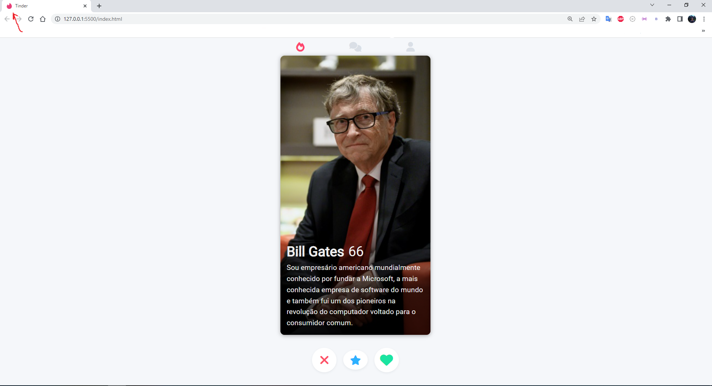

# Clone do Tinder

Projeto para treinar as habilidades em HTML e CSS, que foi desenvolvido durante o curso de formação da <a href="https://imalearningplace.com/" target="_blank">ImãLearningPlace</a> para Desenvolvedor Web FullStack Jr

 

<h1>Alterações em relação ao projeto original</h1>

<ul>
    <li>Adicionei a propriedade "background-position", pois a imagem estava cortando a parte do rosto do Bill Gates.</li>
    <li>Adicionei a favicon do tinder.</li>
    <li>A imagem do Bill Gates e as caracteristicas dele.</li>
</ul>

<h1>Projeto Original</h1>

<a href="https://www.youtube.com/watch?v=bLNar9fmtqk&t=1s" target="_blank">https://www.youtube.com/watch?v=bLNar9fmtqk&t=1s</a>

<h1>Tecnologias</h1>

<ul>
    <li>HTML</li>
    <li>CSS</li>
</ul>

<h1>Sites </h1>

Sites que ajudaram no desenvolvimento dessa aplicação.

<ul>
    <li><a href="https://fontawesome.com/" target="_blank">Ícones</a></li>
    <li><a href="https://fonts.google.com/" target="_blank">Fonte</a></li>
    <li><a href="https://cssgradient.io/" target="_blank">Gradiente</a></li>
</ul>

